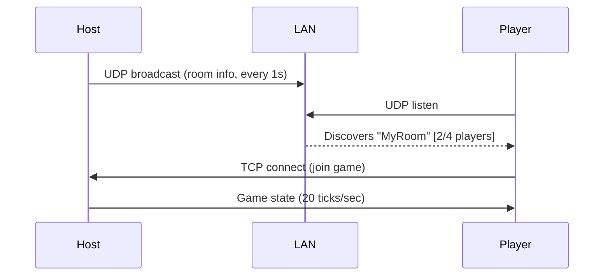

# 💣 Go-Bomberman TUI

A multiplayer Bomberman game for the terminal with **automatic room discovery** over your local network.

No IP addresses needed — just create a room and your friends will see it automatically!

## Quick Start

```bash
go run ./cmd/bomberman/
```

That's it! Use the menu to:
- **Create Room** — Host a game, others on your network will see it
- **Join Room** — Browse and join rooms on your network

## Controls

| Key | Action |
|-----|--------|
| `W` / `↑` | Move Up |
| `S` / `↓` | Move Down |
| `A` / `←` | Move Left |
| `D` / `→` | Move Right |
| `Space` | Place Bomb |
| `Enter` | Start Game (lobby) / Select (menu) |
| `Esc` | Back / Quit |

## How It Works

1. **Host** creates a room → starts TCP game server + UDP broadcast
2. **Players** browse rooms → UDP listener discovers rooms on the LAN
3. Player selects a room → TCP connects to the host
4. **Enter** starts the game from the lobby



## Building

```bash
# Build single binary
go build -o bomberman ./cmd/bomberman/

# Cross-compile for friends
GOOS=windows GOARCH=amd64 go build -o bomberman.exe ./cmd/bomberman/
GOOS=darwin GOARCH=arm64 go build -o bomberman-mac ./cmd/bomberman/
```

## Features

- **LAN Room Discovery** — UDP broadcast auto-discovers rooms (Mini Militia-style)
- **Server-Authoritative** — All game logic on the server, no cheating
- **Concurrent Bombs** — Chain reactions, soft wall destruction
- **Rich TUI** — Lipgloss-styled with player colors, fire effects, HUD
- **Single Binary** — One executable for hosting and joining

## Project Structure

```
go-bomberman/
├── cmd/bomberman/       # Single unified entry point
├── internal/
│   ├── game/            # Engine (types, board, movement, bombs)
│   ├── network/         # TCP protocol, server, client
│   ├── discovery/       # UDP broadcast room discovery
│   └── ui/              # Bubbletea model + Lipgloss renderer
├── go.mod
└── README.md
```

## Flags

| Flag | Default | Description |
|------|---------|-------------|
| `--name` | *(prompted)* | Your player name |
| `--port` | `9999` | TCP game port (hosting) |

## License

MIT
